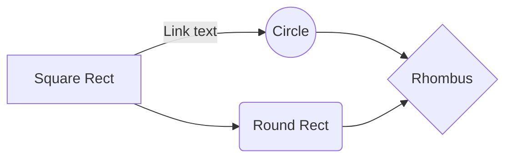

# Welcome to my Thesis Project!  **REST OF README WILL BE COMPLETED, THIS IS NOT LATEST VERSION.**

Hi! I am Ali Mert. I am 4th-grade Undergraduate Computer Engineering student at Marmara University, Istanbul. This is my Thesis project which is about **Web Scraping and Car Price Prediction using Machine Learning**.

# Web Scraping and Car Price Prediction using Machine Learning

## Web Scraping Part
The project aimed to scrape car data from an un-allowed website. Thanks to this, I would have learned about **bypassing restrictions** from source website. 

The website was completely blocking robot requests, so in the early stage of project, each request pretended to be like human. 
But on that stage, it was noticed that the web page blocks the user connection not only for robot requests, but also if there are many requests sent over the same network in a short time.

To prevent this, a private proxy service which is called **ScrapingBee** was used in this project. However, if you are trying to access it from any proxy outside of Turkey, it has been noticed that the web page prefers not to display any web page content and asks you to log in to view the content.

To avoid this, Turkey-located proxies were used. In this way, there is no problem left.

## Price Prediction and Machine Learning Part
To be continued...

# Table of Contents

 - PricePrediction.ipynb
 - AddHeadersToCSV.py
 - DatasetPrep.py
 - GetAllLinks.py
 - ScrapeCarInfos.py
 - ScrapedData.csv
 - CarDataset.csv
 - CarURLS.csv
 - LICENSE
 - README.md

## Motivation

The use of **Machine Learning Applications**  in our daily lives is increasing day by day. So, I wanted to apply an application about this field of area and try to contribute to the community.

# Publication

Publishing in StackEdit makes it simple for you to publish online your files. Once you're happy with a file, you can publish it to different hosting platforms like **Blogger**, **Dropbox**, **Gist**, **GitHub**, **Google Drive**, **WordPress** and **Zendesk**. With [Handlebars templates](http://handlebarsjs.com/), you have full control over what you export.

> Before starting to publish, you must link an account in the **Publish** sub-menu.

## SmartyPants

SmartyPants converts ASCII punctuation characters into "smart" typographic punctuation HTML entities. For example:

|                |ASCII                          |HTML                         |
|----------------|-------------------------------|-----------------------------|
|Single backticks|`'Isn't this fun?'`            |'Isn't this fun?'            |
|Quotes          |`"Isn't this fun?"`            |"Isn't this fun?"            |
|Dashes          |`-- is en-dash, --- is em-dash`|-- is en-dash, --- is em-dash|

## UML diagrams

